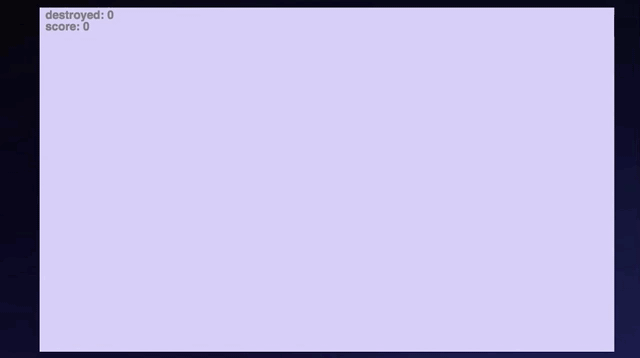

# Dodge to Live 

[Live](https://gksksla7140.github.io/dodge-to-live/)

## Background Overview 
Dodge to Live is a clone of mobile game called [Tilt To Live](https://itunes.apple.com/us/app/tilt-to-live/id335454448?mt=8). This project is done by using javascript and [P5.js](https://p5js.org/).

## How to play

- Players can move with a mouse pointer
- Press SPACE to start
- Players can destroy red dots by triggering yellow bombs
- Each seconds, players gain 4 points and each elimination of red dots, players gain 1 point.

## Functionality and MVP Features
- Setting up canvas with a pointer following a mouse pointer.
- Spawning red dots in a random position and follows the pointer. If any of the dots contact with the pointer the game ends
- Item spawns randomly on the map. When an item is touched by the pointer, it triggers each items
- Animation effect when red dots die and when item is triggerd

